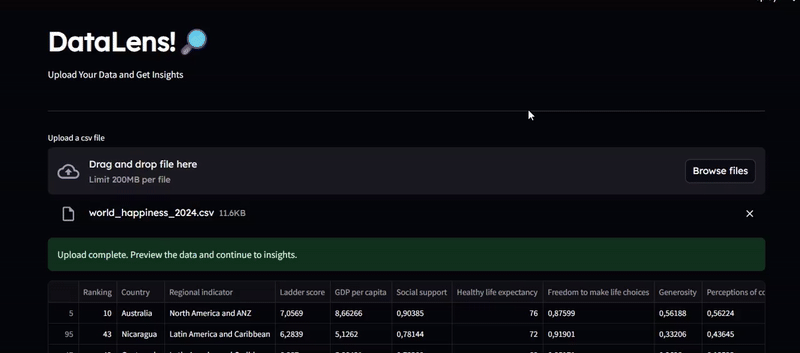
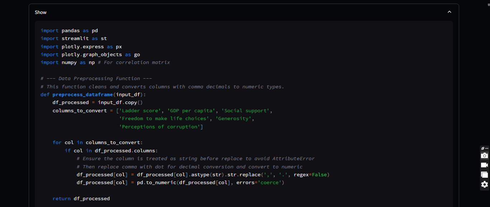
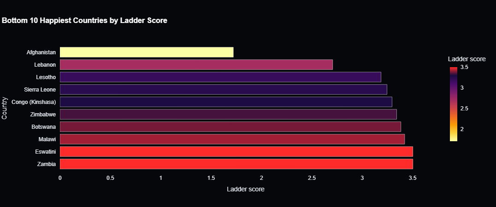

# DataLens!🔎
Check out the Live Preview here
[Live Preview](https://datalensproject.streamlit.app/)


[](https://www.python.org/downloads/)
[](https://streamlit.io/)
[](https://pandas.pydata.org/)
[](https://plotly.com/)
[](https://ai.google.dev/)

DataLens is a smart tool that helps you quickly understand your data. Just upload a CSV file, and DataLens will automatically create charts, summaries, and dashboards to show you what's inside. It's like having a data expert who does all the hard work for you!




**Disclaimer:** This tool is intended to aid data analysis or serve as a starting point, especially for non-technical users. It does not replace the need for a thorough and nuanced data analysis by a qualified professional.

## How it Works

DataLens uses the power of Google's Gemini model to analyze your data. Here's a step-by-step breakdown of the process:

1.  **Upload CSV:** You start by uploading a CSV file.
2.  **Data Analysis:** The application reads the CSV, identifies the data types, and prepares a prompt for the Gemini model. This prompt includes the data schema and a sample of the data.
3.  **Code Generation:** The Gemini model receives the prompt and generates Python code for a Streamlit dashboard, including charts, KPIs, and insights.
4.  **Dashboard Display:** The generated code is then executed to display the interactive dashboard.
5.  **Error Fixing:** If the generated code has any errors, you can click the "Fix Errors" button, and the app will ask the Gemini model to fix the code.

## How to Run

To get started with DataLens, you'll need to have Python installed. Then, follow these steps:

1. **Clone the repository:**
   ```bash
   git clone https://github.com/pye024/DataLens
   cd DataLens
   ```

2. **Install the required packages:**
   ```bash
   pip install -r requirements.txt
   ```

3. **Get a Gemini API Key:**
   - Go to [Google AI for Developers](https://aistudio.google.com/app/apikey) and create an API key.
   - Create a `.env` file in the project root and add your key like this:
     ```
     GEMINI_API_KEY="YOUR_API_KEY"
     ```

4. **Run the app:**
   ```bash
   streamlit run app.py
   ```

This will open DataLens in your web browser.

## How to Run with Docker

Alternatively, you can run DataLens using Docker:

1. **Build the Docker image:**
   ```bash
   docker build -t datalens .
   ```

2. **Run the Docker container:**
   ```bash
   docker run -p 8501:8501 -e GEMINI_API_KEY="YOUR_API_KEY" datalens
   ```

   Make sure to replace `"YOUR_API_KEY"` with your actual Gemini API key.

   This will start the app on `http://localhost:8501`.

## Example

Here's an example of a code preview generated by DataLens:




